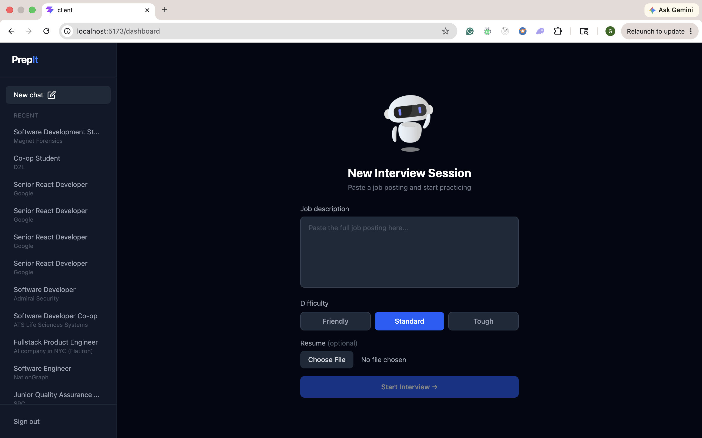
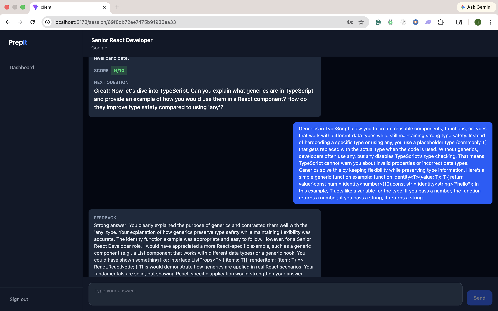

# PrepIt 

An AI-powered mock interview platform that helps you practice technical interviews with real-time feedback, scoring, and progress tracking.

---

## What It Does

Paste a job posting → PrepIt parses the role and required skills → An AI interviewer asks you targeted technical questions → Get scored and receive detailed feedback after every answer.

---

## Screenshots

### Dashboard


### Interview in Action


---

## Tech Stack

| Layer | Technology |
|---|---|
| Frontend | React 18 + TypeScript + Vite |
| Styling | Tailwind CSS v4 |
| State | TanStack Query + Context API |
| Backend | Node.js + Express.js |
| Database | MongoDB + Mongoose |
| AI | Anthropic Claude API |
| Auth | JWT + bcrypt |
| Streaming | Server-Sent Events (SSE) |

---

## Features

- **AI Job Parser** — paste any job posting, Claude extracts job title, company, required and preferred skills automatically
- **Streaming Interview** — responses stream token by token like ChatGPT for a natural interview feel
- **Structured Scoring** — every answer is scored 1-10 with detailed feedback on what you did well and where to improve
- **Resume Upload** — upload your PDF resume and Claude asks personalized questions based on your actual experience and projects
- **Difficulty Modes** — choose between Friendly, Standard, or Tough — each mode changes the interviewer's tone, question depth, and scoring rubric
- **Dynamic Robot Animation** — the interviewer robot changes personality based on difficulty (friendly robot → evil robot on tough mode)
- **No-Repeat Questions** — Claude tracks every question already asked and never repeats them in the same session
- **Auto Start** — interview begins automatically when you open a new session, no manual trigger needed
- **Session History** — all conversations persist so you can review past interviews with full scores and feedback
- **Sliding Window Context** — last 10 messages sent to Claude keeping token costs controlled
- **Usage Tracking** — every Claude API call logs input tokens, output tokens, cost, and latency
- **Prompt Versioning** — switch between prompt versions via env var, no code changes needed
- **Protected Routes** — JWT auth guards all interview sessions, logged in users redirected away from auth pages
- **Real-time UI** — live streaming chat with auto-scroll, typing indicators, and animated placeholders

---

## Prompt Engineering Results

v1 vs v2 prompt comparison (5 test answers, Claude Haiku 4.5):

| Metric | v1 | v2 | Change |
|---|---|---|---|
| Input tokens | 290 avg | 426 avg | +136 |
| Output tokens | 241 avg | 148 avg | −38% |
| Cost per call | $0.001497 | $0.001167 | −22% |
| Latency | 4512ms | 2653ms | −41% |
| JSON compliance | 100% | 100% | same |

Key finding: adding a few-shot example increased input tokens but made Claude respond more concisely — net 22% cheaper and 41% faster.

---

## Project Structure

```
Prepit/
├── client/                       # React frontend
│   └── src/
│       ├── api/
│       │   └── axios.ts          # axios instance with auth interceptor
│       ├── components/
│       │   ├── ChatInput.tsx
│       │   ├── MessageBubble.tsx
│       │   ├── CreateSession.tsx  # resume upload + difficulty picker
│       │   ├── SessionsList.tsx
│       │   └── Sessions.tsx
│       ├── context/
│       │   └── AuthContext.tsx
│       ├── guards/
│       │   ├── ProtectedRoute.tsx
│       │   └── PublicRoute.tsx    # redirects logged in users
│       ├── hooks/
│       │   └── useInterview.ts    # streaming + history + auto start
│       ├── layouts/
│       │   ├── MainLayout.tsx
│       │   └── DashboardLayout.tsx
│       └── pages/
│           ├── Home.tsx
│           ├── Login.tsx
│           ├── Register.tsx
│           ├── Dashboard.tsx
│           └── Interview.tsx
│
└── backend/                      # Express backend
    └── src/
        ├── config/
        │   └── db.js
        ├── controllers/
        │   ├── authController.js
        │   ├── sessionController.js
        │   └── interviewController.js
        ├── middleware/
        │   ├── authMiddleware.js
        │   └── upload.js          # multer PDF upload
        ├── models/
        │   ├── User.js
        │   ├── Session.js         # difficulty + resumeText fields
        │   ├── Conversation.js    # score + feedback fields
        │   └── UsageLog.js        # token + cost tracking
        ├── prompts/
        │   ├── v1.js              # original prompt
        │   └── v2.js              # few-shot + rubric + format first
        ├── routes/
        │   ├── authRoutes.js
        │   ├── sessionRoutes.js
        │   └── interviewRoutes.js
        └── services/
            ├── aiService.js       # Claude stream + usage logging
            └── promptBuilder.js   # loads prompt version from env
```

---

## Getting Started

### Prerequisites

- Node.js 18+
- MongoDB Atlas account
- Anthropic API key — get one at [console.anthropic.com](https://console.anthropic.com)

---

### 1. Clone the repo

```bash
git clone https://github.com/Gursimran07316/Prepit
cd prepit
```

---

### 2. Setup Backend

```bash
cd backend
npm install
```

Create a `.env` file:

```
PORT=5003
MONGO_URI=your_mongodb_connection_string
JWT_SECRET=your_long_random_secret
ANTHROPIC_API_KEY=sk-ant-your_key_here
PROMPT_VERSION=v2
CLIENT_URL=http://localhost:5173
```

Start the server:

```bash
npm run dev
```

---

### 3. Setup Frontend

```bash
cd client
npm install
```

Create a `.env` file:

```
VITE_API_URL=http://localhost:5003/api
```

Start the app:

```bash
npm run dev
```

---

### 4. Open the app

```
http://localhost:5173
```

---

## How It Works

### Auth Flow
```
Register / Login → JWT token issued → stored in localStorage
→ attached to every request via axios interceptor
→ protected routes check token via middleware
→ logged in users redirected away from login/register
```

### Interview Flow
```
Paste job posting + optional resume + pick difficulty
→ Claude extracts skills from job posting
→ Session created in MongoDB with resumeText + difficulty
→ Interview page opens → auto sends "Start the interview"
→ Claude asks personalized first question
→ User answers → saved to Conversation collection
→ Claude streams response via SSE → chunks appear in real time
→ Full response parsed → score + feedback saved separately
→ History loads on return visit with isFetching guard
→ Sliding window sends last 10 messages for context
→ Every API call logged to UsageLog with tokens + cost + latency
```

### Prompt Versioning
```
PROMPT_VERSION=v1  →  loads prompts/v1.js
PROMPT_VERSION=v2  →  loads prompts/v2.js
Switch with one env var change, no code edits needed
```

---

## API Endpoints

### Auth
```
POST /api/auth/register              — create account
POST /api/auth/login                 — login, returns JWT
GET  /api/auth/profile               — get current user (protected)
```

### Sessions
```
POST /api/sessions/create            — create session (multipart/form-data)
GET  /api/sessions/get               — get all sessions for user
GET  /api/sessions/:id               — get session by id
GET  /api/sessions/:id/conversations — get conversation history
```

### Interview
```
POST /api/interview/respond          — send message, stream Claude response
```

---

## Environment Variables

### Backend

| Variable | Description |
|---|---|
| `PORT` | Backend port (default 5003) |
| `MONGO_URI` | MongoDB connection string |
| `JWT_SECRET` | Secret for signing JWT tokens |
| `ANTHROPIC_API_KEY` | Anthropic API key for Claude |
| `PROMPT_VERSION` | Prompt version to use (v1 or v2) |
| `CLIENT_URL` | Frontend URL for CORS |

### Frontend

| Variable | Description |
|---|---|
| `VITE_API_URL` | Backend API base URL |

---


## License

MIT